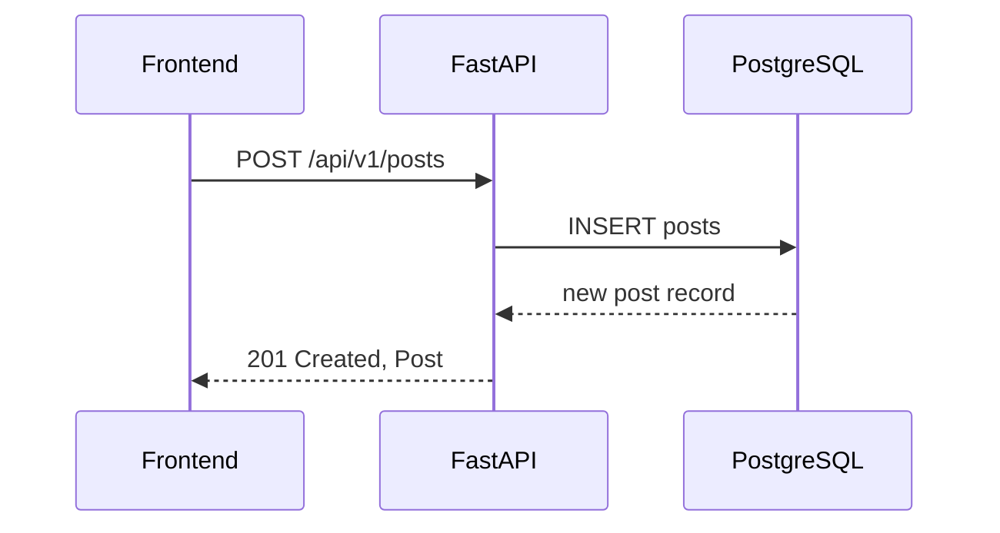

# 詳細設計書

## 1. APIエンドポイント詳細

### 1.1 認証／認可

| エンドポイント              | メソッド | 説明                     | リクエスト                                       | レスポンス                                                             |
| -------------------- | ---- | ---------------------- | ------------------------------------------- | ----------------------------------------------------------------- |
| `/api/v1/auth` | POST | OAuth2 パスワードフローでトークン取得 | `grant_type`, `username`, `password` (form) | `{ access_token: string, token_type: "bearer", expires_in: int }` |

### 1.2 ユーザー管理

| エンドポイント                   | メソッド   | 説明       | リクエスト Body                      | レスポンス Body                            |
| ------------------------- | ------ | -------- | ------------------------------- | ------------------------------------- |
| `/users`           | GET    | ユーザー一覧取得 | `Authorization: Bearer <token>` | `{ users: User[] }`                   |
| `/users`           | POST   | ユーザー登録   | `{ username, email, password }` | `{ id, username, email, created_at }` |
| `/users/{user_id}` | GET    | ユーザー詳細取得 | `Authorization: Bearer <token>` | `User`                                |
| `/users/{user_id}` | PUT    | ユーザー情報更新 | `{ username?, email? }`         | `User`                                |
| `/users/{user_id}` | DELETE | ユーザー削除   | `Authorization: Bearer <token>` | `{ detail: "deleted" }`               |

### 1.3 投稿機能 (Posts)

| エンドポイント                   | メソッド   | 説明     | リクエスト Body                                               | レスポンス Body                      |
| ------------------------- | ------ | ------ | -------------------------------------------------------- | ------------------------------- |
| `posts`           | GET    | 投稿一覧取得 | `page`, `size` (query)                                   | `{ posts: Post[], total: int }` |
| `posts`           | POST   | 投稿作成   | `content: string`, `media: File[]` (multipart/form-data) | `Post`                          |
| `posts/{post_id}` | GET    | 投稿詳細取得 |                                                          | `Post`                          |
| `posts/{post_id}` | DELETE | 投稿削除   | `Authorization: Bearer <token>`                          | `{ detail: "deleted" }`         |

### 1.4 フォロー管理

| エンドポイント                            | メソッド | 説明     | リクエスト Body                      | レスポンス Body                 |
| ---------------------------------- | ---- | ------ | ------------------------------- | -------------------------- |
| `users/{user_id}/follow`   | POST | フォロー追加 | `Authorization: Bearer <token>` | `{ detail: "followed" }`   |
| `users/{user_id}/unfollow` | POST | フォロー解除 | `Authorization: Bearer <token>` | `{ detail: "unfollowed" }` |

### 1.5 チャット（1対1）

| エンドポイント                              | メソッド      | 説明          | リクエスト Body               | レスポンス Body                             |
| ------------------------------------ | --------- | ----------- | ------------------------ | -------------------------------------- |
| `/chats/rooms`                | GET       | チャットルーム一覧取得 | Authorization ヘッダー       | `{ rooms: ChatRoom[] }`                |
| `/chats/rooms/{room_id}/logs` | GET       | メッセージログ取得   | `page`, `size` (query)   | `{ logs: Message[], total: int }`      |
| `/ws/chats/{room_id}`                | WebSocket | メッセージ送受信    | `{ content: string }` 送信 | `{ sender_id, content, timestamp }` 受信 |

### 1.6 グループチャット

| エンドポイント                          | メソッド      | 説明          | リクエスト Body                             | レスポンス Body                          |
| -------------------------------- | --------- | ----------- | -------------------------------------- | ----------------------------------- |
| `/groups`                 | GET       | グループ一覧取得    | Authorization ヘッダー                     | `{ groups: Group[] }`               |
| `/groups`                 | POST      | グループ作成      | `{ name: string, member_ids: UUID[] }` | `Group`                             |
| `/groups/{group_id}`      | GET       | グループ詳細取得    |                                        | `Group`                             |
| `/groups/{group_id}/chat` | WebSocket | グループチャット送受信 | `{ content: string }`                  | `{ sender_id, content, timestamp }` |

### 1.7 AI分析・要約

| エンドポイント                      | メソッド | 説明     | リクエスト Body                                 | レスポンス Body                |           |                |
| ---------------------------- | ---- | ------ | ------------------------------------------ | ------------------------- | --------- | -------------- |
| `/analysis/topics`    | POST | トピック抽出 | `{ text: string }`                         | `{ topics: string[] }`    |           |                |
| `/analysis/sentiment` | POST | 感情分析   | `{ text: string }`                         | \`{ sentiment: "positive" | "neutral" | "negative" }\` |
| `/analysis/summaries` | POST | 要約生成   | `{ target_type: string, target_id: UUID }` | `{ summary: string }`     |           |                |

## 2. データベーススキーマ

### 2.1 `users`

| カラム名              | 型                 | 制約                              |
| ----------------- | ----------------- | ------------------------------- |
| `id`              | UUID              | PK, default gen\_random\_uuid() |
| `username`        | VARCHAR(50)       | UNIQUE, NOT NULL                |
| `email`           | VARCHAR(100)      | UNIQUE, NOT NULL                |
| `hashed_password` | VARCHAR(128)      | NOT NULL                        |
| `created_at`      | TIMESTAMP WITH TZ | DEFAULT now()                   |
| `updated_at`      | TIMESTAMP WITH TZ | DEFAULT now()                   |

### 2.2 `posts`

| カラム名         | 型                 | 制約              |
| ------------ | ----------------- | --------------- |
| `id`         | UUID              | PK              |
| `user_id`    | UUID              | FK -> users(id) |
| `content`    | TEXT              | NOT NULL        |
| `media_urls` | TEXT\[]           |                 |
| `created_at` | TIMESTAMP WITH TZ | DEFAULT now()   |

### 2.3 `follows`

| カラム名          | 型                 | 制約              |
| ------------- | ----------------- | --------------- |
| `id`          | UUID              | PK              |
| `follower_id` | UUID              | FK -> users(id) |
| `followee_id` | UUID              | FK -> users(id) |
| `created_at`  | TIMESTAMP WITH TZ | DEFAULT now()   |

### 2.4 `messages`

| カラム名        | 型                 | 制約                    |
| ----------- | ----------------- | --------------------- |
| `id`        | UUID              | PK                    |
| `room_id`   | UUID              | FK -> chat\_rooms(id) |
| `sender_id` | UUID              | FK -> users(id)       |
| `content`   | TEXT              | NOT NULL              |
| `timestamp` | TIMESTAMP WITH TZ | DEFAULT now()         |

### 2.5 `chat_rooms`

| カラム名         | 型                 | 制約                   |
| ------------ | ----------------- | -------------------- |
| `id`         | UUID              | PK                   |
| `type`       | TEXT              | 'one2one' or 'group' |
| `created_at` | TIMESTAMP WITH TZ | DEFAULT now()        |

### 2.6 `group_members`

| カラム名        | 型                 | 制約                    |
| ----------- | ----------------- | --------------------- |
| `id`        | UUID              | PK                    |
| `group_id`  | UUID              | FK -> chat\_rooms(id) |
| `user_id`   | UUID              | FK -> users(id)       |
| `joined_at` | TIMESTAMP WITH TZ | DEFAULT now()         |

### 2.7 `summaries`

| カラム名           | 型                 | 制約               |
| -------------- | ----------------- | ---------------- |
| `id`           | UUID              | PK               |
| `target_type`  | TEXT              | 'post' or 'chat' |
| `target_id`    | UUID              | 対象ID             |
| `summary_text` | TEXT              | NOT NULL         |
| `created_at`   | TIMESTAMP WITH TZ | DEFAULT now()    |

## 3. WebSocketメッセージ仕様

```jsonc
// クライアント→サーバー
{
  "event": "message",      // 'message' 固定
  "data": {
    "room_id": "UUID",     // チャットルームID
    "content": "text"      // メッセージ本文
  }
}

// サーバー→クライアント
{
  "event": "broadcast",    // 'broadcast' 固定
  "data": {
    "room_id": "UUID",
    "sender_id": "UUID",
    "content": "text",
    "timestamp": "ISO8601"
  }
}
```

## 4. フロントエンドコンポーネント設計

### 4.1 ページ構成

* **LoginPage.vue**: ログインフォーム、認証処理
* **TimelinePage.vue**: 投稿一覧、投稿フォーム
* **ChatPage.vue**: 1対1チャットUI (Socket.IO)
* **GroupChatPage.vue**: グループチャットUI
* **AnalysisDashboard.vue**: 投稿・チャット分析結果表示

### 4.2 主なコンポーネント

* `PostForm.vue` (props: none, emits: created)
* `PostList.vue` (props: posts)
* `ChatRoomList.vue` (props: rooms)
* `ChatWindow.vue` (props: roomId)
* `AnalysisCard.vue` (props: summary)

## 5. 非機能設計

* **エラーハンドリング**: 全APIは標準エラー形式 `{ detail: string, code: int}` を返却
* **ログ出力**: structlogでJSON形式ログ、CloudWatchに連携
* **リトライ**: OpenAI呼び出しは5xxエラー時3回リトライ
* **セキュリティ**: JWTトークンはHTTP Only Cookieにも対応

## 6. シーケンス図（Post作成）



---

*以上*
